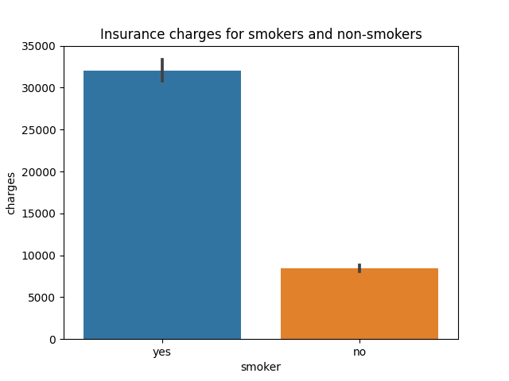

# Hypothesis-Testing
 
### Goals: 
 Perform a number of Hypothesis-Test on data about smokers and their insurance.
 
### Data
This US Health Insurance Dataset is from Kaggle. https://www.kaggle.com/datasets/teertha/ushealthinsurancedataset. 
This data set has 7 features and 1,337 rows. The key features are listed below. 
 - age
 - sex
 - bmi
 - #children
 - smoker
 - region
 - charges
 
## Hypothesis

### **Q1: Do some MPAA Ratings make more revenue than others?**
**Hypothesis**

 - $H_0$: There is no difference between smokers and non smokers regarding insurance charges.

 - $H_1$: There is a difference between smokers and non-smokers in insurance charges.

Data Type : Numeric

Samples: 2 samples/groups

Test : 2 Sample T-Test

Assumptions: 

 - No significant outliers 
 - Normality 
 - Equal Variance 

**Preperation**

We first split the data into two groups. One of the charges for smokers and one for the charges for non-smokers

**Outliers Removed**
 - Number of outliers removed from smoker charges : 0
 - Number of outliers removed from non-smoker charges : 24
 
**Normality Assumption**
 - We failed the test for normality. However, we can still proceed as planned because we have more then 15 samples in each group.

**Equal Variance**
 - Because we failed the test of equal variance we have to perform a t-test. 

**Final Conclusion**

    Ttest_indResult(statistic=33.723466247187815, pvalue=2.7282718648018296e-104)
Explanation: In this case we have a significant p-value which means we reject our null hypothesis and support our alternative hypthesis that "There is a difference between smokers and non-smokers in insurance charges.".

### **Q2: Are men more likely to smoke than women?**
**Hypothesis**

$H_0$: Men and women are equally likely to be smokers.

$H_1$: There is a difference between Men and women in there likelyhood of being a smoker. 

Data Type : Categorical

Sample : 2 samples/groups

Test : Chi-Square

Assumptions : 
 - There are two categorical variables (ordinal or nominal), And
 - Their outcomes are independent.
 
**Preperation**

First we need to split the data into two groups. One for Male and Female and then whether they are a smoker.

**Final Conclusion**

    p = 0.0062765550120107375
Explanation: Because we have a significant p value we reject our null hypothesis and support our alternative hypthesis. We conclude that there is a difference between the rate of males and females becoming smokers. It appears that males are more likely to be smokers. 

sex       |female  | male

non-smoker|0.826284| 0.764444

smoker    |0.173716| 0.235556

### **Do different regions have different charges, on average?**
$H_0$: There is no difference in charges between regions.

$H_1$: There is a difference in charges, on average, between regions.

Data Type : Numerical

Sample : More than 2 samples/groups

Test : ANOVA and/or Tukey

Assumptions : 
 - No significant outliers 
 - Equal variance 
 - Normality
 
**Preperation**

We first split the data into the four redions in our dataset; northwest, northeast, southwest southeast.

**Outliers Removed**
 - Region southwest -> Number of outliers :  8
 - Region southeast -> Number of outliers :  2
 - Region northwest -> Number of outliers :  7
 - Region northeast -> Number of outliers :  4
 
**Normality Assumption**

            n       p               test stat   sig
southwest	317.0	7.728611e-22	97.223886	True
southeast	362.0	1.936990e-13	58.544942	True
northwest	317.0	3.547435e-19	84.965784	True
northeast	320.0	3.557877e-17	75.749565	True

 - Despite having failed the normal test we can continue as planed because all of our groups contain more then 20 samples

**Equal Variance**
 - Because we failed the test of equal variance (a.k.a levenes test) we have to perform a t-test. As a result we need to perform a Kruskal-Wallis teset instead of ANOVA test.
 

**Final Conclusion**

    KruskalResult(statistic=4.622506584464645, pvalue=0.20161983372311595)
Explanation: In this case we do not have a significant p-value which means we fail to reject our null hypothesis or we failed to conclude that its NOT due to random chance. 

## For further information
zevy613@gmail.com
